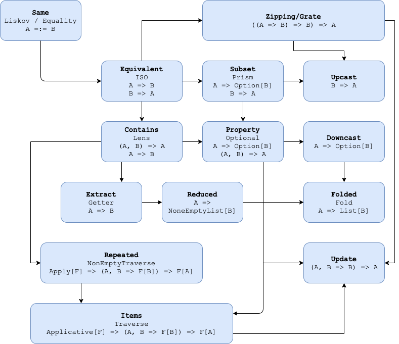

## Installation
:::tip[Tofu]{icon="download"}
```
"tf.tofu" %% "tofu" % "@VERSION"
```  
:::
or as standalone dependencies

:::tip[Optics]{icon="download"}
```
"tf.tofu" %% "tofu-optics-core" % "@VERSION" 
"tf.tofu" %% "tofu-optics-macro" % "@VERSION"
"tf.tofu" %% "tofu-optics-interop" % "@VERSION"
```  
:::
 
## Functionality
Tofu contains its own optics library with some notable features:
- subtyping: You don't need to convert more powerful optic to weaker one
- unified composition operator

Hierarchy
---------



Intuition
---------

If you ever used [lens](https://github.com/ekmett/lens) optics' names will be quite familiar to you,
but for a [Monocle](https://github.com/julien-truffaut/Monocle) user `Tofu`'s naming may be confusing. The following table may clear things up:

| Monocle | tofu |
|---------|------|
| Iso | Equivalent |
| Prism | Subset |
| Lens | Contains |
| Optional | Property |
| Traversal | Items |
| Getter | Extract |
| Fold | Folded |
| Setter | Update |
